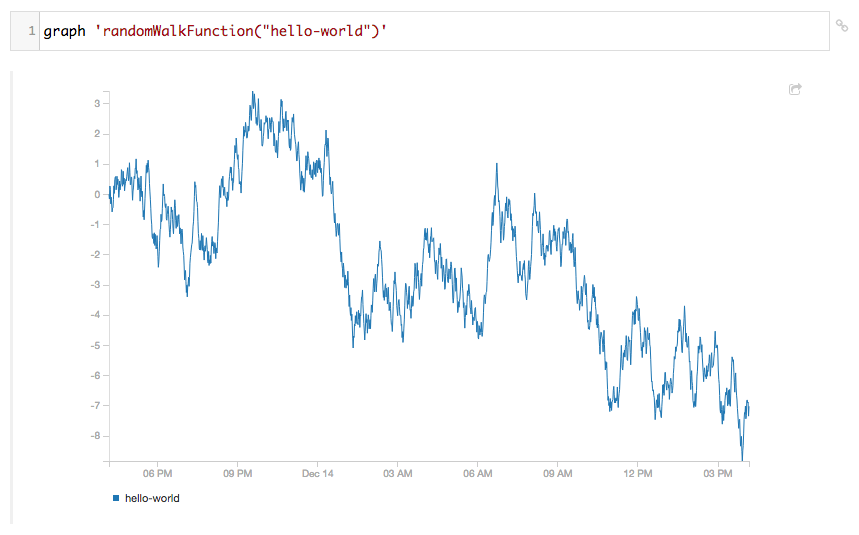
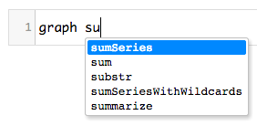

# lead.js Quick Start

**tl;dr** type CoffeeScript in the box, run it with <kbd>Shift</kbd> <kbd>Enter</kbd>. Use <kbd>Ctrl</kbd> <kbd>Space</kbd> to suggest function names, options, and metric names.

## Graphing

lead.js was made to graph things, especially Graphite things. Graph any Graphite target using the `graph` function. Type `graph 'randomWalkFunction("hello-world")'` in the first empty box (input cell) on the page, and press <kbd>Shift</kbd> <kbd>Enter</kbd>:



There are tons of built-in Graphite functions, and lead.js knows about them. In the previous example, we sent the string 'randomWalkFunction("hello-world")' to Graphite, which is fine, but editing these strings is tedious. Since the Graphite target langauge looks an awful lot like function calls in many other languages, we can easily map the Graphite functions to CoffeeScript functions. lead.js does this, providing a simple Graphite DSL, so you can write

<!-- norun -->
```coffeescript
graph randomWalkFunction("hello-world")
```

and get the same result.

There's one important difference between the Graphite target language and CoffeeScript: Graphite uses unquoted strings for metric names. Let's say you're tracking the tweeting habbits of various celebrities on twitter, and you have metric names like `twitter.neiltyson.tweetcount`, `twitter.cmdr_hadfield.tweetcount`, etc. With Graphite, if you wanted to sum all these series, you could use

<!-- norun -->
```
sumSeries(twitter.*.tweetcount)
```

Which is obviously not valid CoffeeScript. We can't just use strings, like `sumSeries("twitter.*.tweetcount")`, or Graphite won't interpret them as metrics. Instead, lead.js provides the `q` function to indicate a Graphite metric name. You use it like this:

<!-- norun -->
```coffeescript
sumSeries(q('twitter.*.tweetcount'))
```

## Autocompletion

lead.js can suggest functions, metrics names and options using <kbd>Ctrl</kbd> <kbd>Space</kbd>.




Inside a string, this will suggest metric names. Elsewhere, it will suggest available functions and options.

## Sharing Your Work

Next to any input cell, there's a "link" link. Clicking it will generate a link that runs the command in the cell. For our `randomWalkFunction` graph, the link would look like http://example.com/lead/?Z3JhcGggJ3JhbmRvbVdhbGtGdW5jdGlvbigiaGVsbG8td29ybGQiKSc%3D. You can share this link with anyone who has access to your lead.js.

## Key Bindings

The most important bindings are:

* <kbd>Shift</kbd> <kbd>Enter</kbd>: Execute the current cell and create a new one underneath
* <kbd>Ctrl</kbd> <kbd>Enter</kbd>: Execute the current cell and keep the cursor there
* <kbd>F1</kbd>: Show help for the command under the cursor
* <kbd>Ctrl</kbd> <kbd>Space</kbd>: Suggest a function or metric.

Get a list of all key bindings using the `keys` command.
